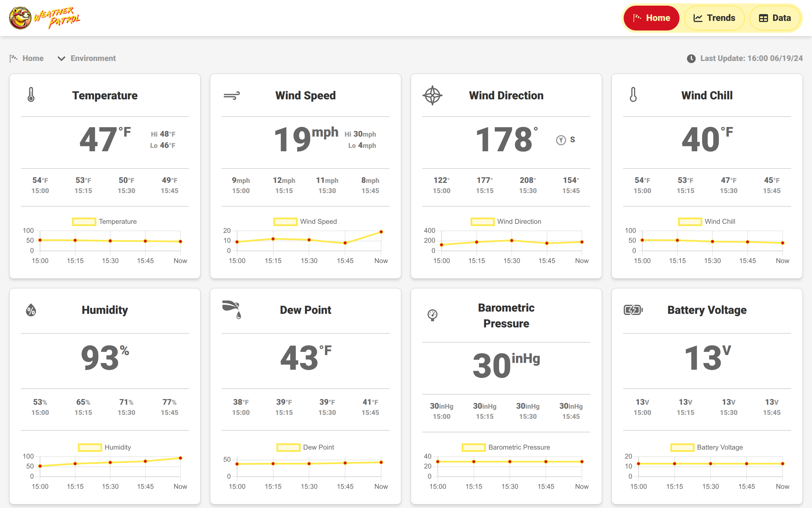
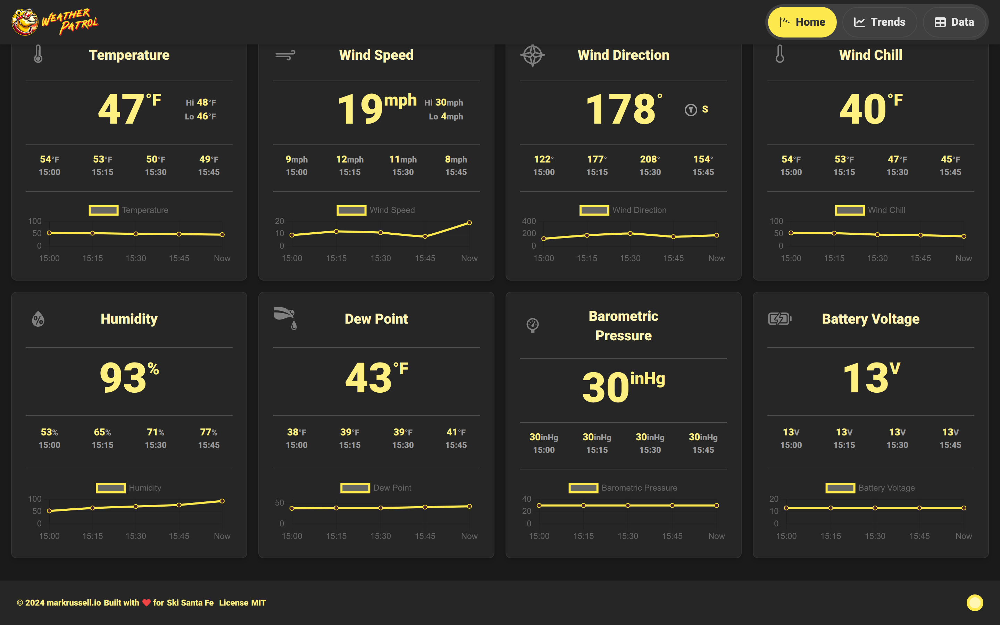
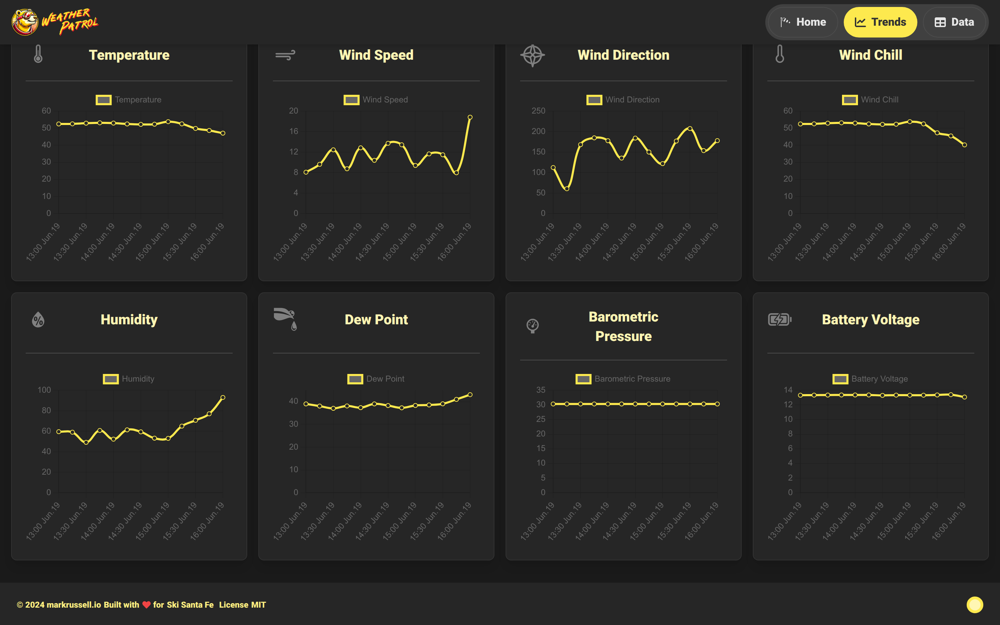
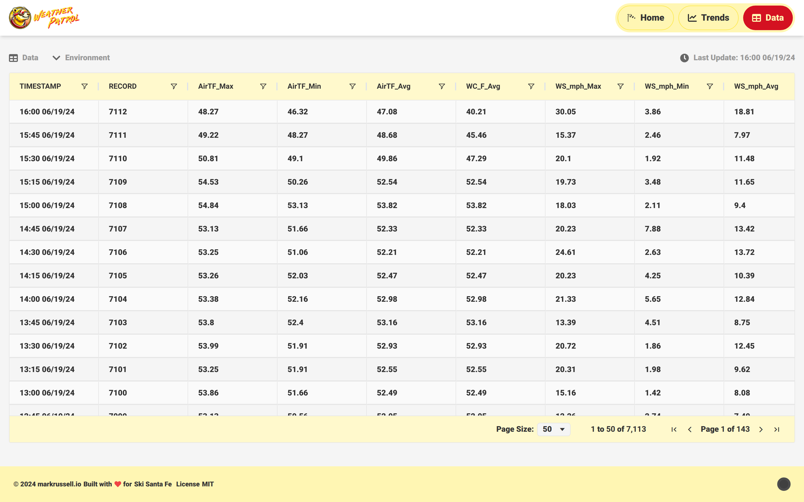

# Weather Patrol

Weather Patrol is a full-stack application for processing and displaying data from a Campbell Scientific weather station.

The backend monitors a TOA5 data file, validates and caches incoming observations, and exposes them through REST endpoints and Server-Sent Events. The React frontend presents current conditions, historical trends, station metadata, and the underlying observation records.



## Project status

The application was completed and used with Ski Santa Fe weather-station data.

The hosted demonstration is currently offline because maintaining paid hosting for the frontend and backend was no longer justified. The screenshots below show the application running locally with archived station data.

## Interface

### Current conditions

The Home view displays the latest observation alongside recent readings and compact trend charts.



### Historical trends

The Trends view plots recent changes across temperature, wind, humidity, dew point, pressure, and station battery voltage.



### Observation data

The Data view provides direct access to parsed TOA5 records with filtering and pagination.



## What it demonstrates

- Processing Campbell Scientific TOA5 weather data
- File monitoring and automatic data ingestion
- Schema-based data validation
- REST API design
- Real-time browser updates with Server-Sent Events
- In-memory caching
- API-key authentication
- CORS controls and rate limiting
- React frontend development
- Node.js and Express backend development
- Responsive light and dark interfaces
- Paginated and filterable data tables
- Historical charting and station metadata display

## Architecture

### Frontend

- React
- Vite
- Tailwind CSS
- Axios
- Chart-based current and historical views
- Light and dark themes
- Server-Sent Events for live updates

### Backend

- Node.js
- Express
- Chokidar for monitoring the source data file
- NodeCache for fast access to processed observations
- Schema validation for imported records
- REST endpoints for cached and current data
- Server-Sent Events for real-time updates
- HTTPS, security headers, CORS controls, and rate limiting

## API endpoints

| Endpoint | Purpose |
|---|---|
| `GET /api/latest` | Returns the latest weather observation |
| `GET /api/data` | Returns cached weather records |
| `GET /api/sse` | Opens a real-time event stream |
| `GET /api/health` | Reports application and cache health |

## Local development

Local development requires both the `weather-patrol` frontend and the companion `toa5-file-server` backend.

### Backend configuration

Create `toa5-file-server/.env`:

```env
NODE_ENV=development
PORT=3000
API_KEY=your_local_api_key
FRONTEND_URL=http://localhost:5173
LOG_LEVEL=debug
```

Install dependencies and start the backend:

```bash
cd toa5-file-server
npm install
npm start
```

The backend runs locally over HTTPS on port `3000`.

### Frontend configuration

Create `weather-patrol/.env`:

```env
VITE_API_BASE_URL=https://localhost:3000/api
VITE_API_KEY=your_local_api_key
VITE_LOG_LEVEL=debug
```

Install dependencies and start the frontend:

```bash
cd weather-patrol
npm install
npm run dev
```

Open:

```text
http://localhost:5173
```

Because the backend uses a local HTTPS certificate, the browser may require that certificate to be accepted before the frontend can retrieve weather data.

The backend monitors its configured TOA5 data file and sends updated observations to connected browsers through Server-Sent Events.

## License

MIT